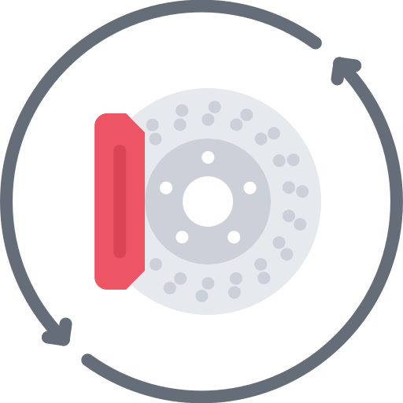

<p align="center" style="text-align:center">
    
</p>

# throttle-wrapper

> Function ignoring call child function more often than ms

[](https://www.npmjs.com/package/throttle-wrapper)
[](https://www.jsdelivr.com/package/npm/throttle-wrapper)


## Table of Contents

- [Quick start](#quick-start)
  - [Install](#install)
  - [Initialization](#initialization)
- [Methods](#methods)
  - [throttle](#throttle)

## Quick start

### Install

We support all platforms.

#### npm

For module bundlers such as Webpack or Browserify.

```shell
npm i throttle-wrapper
```

#### Include with &lt;script&gt;

1. <a href="https://cdn.jsdelivr.net/npm/throttle-wrapper/dist/lib/throttle-wrapper.js" target="_blank">Download lib</a>
2. Add script to html

```html
<script src="throttle-wrapper.js"></script>
```

##### CDN

Recommended for learning purposes, you can use the latest version:

```html
<script src="https://cdn.jsdelivr.net/npm/throttle-wrapper/dist/lib/throttle-wrapper.js"></script>
```

Recommended for production for avoiding unexpected breakage from newer versions:

```html
<script src="https://cdn.jsdelivr.net/npm/throttle-wrapper@0.0.0/dist/lib/throttle-wrapper.js"></script>
```

### Initialization

#### ES6

throttle-wrapper as an ES6 module.

```js
import throttle from 'throttle-wrapper';

let result = [],
    fn = (number) => result.push(number),
    callFnWithThrottle = throttle(fn, 500)

    callFnWithThrottle(1)
    setTimeout(() => callFnWithThrottle(2.1),100)
    setTimeout(() => callFnWithThrottle(2.2),150)
    setTimeout(() => callFnWithThrottle(2.3),180)
    setTimeout(() => callFnWithThrottle(3),200)

    setTimeout(() => console.log(result),300)

```

#### Node

throttle-wrapper as a Node.js module

```js
const throttle = require('throttle-wrapper');

let result = [],
    fn = (number) => result.push(number),
    callFnWithThrottle = throttle(fn, 500)

    callFnWithThrottle(1)
    setTimeout(() => callFnWithThrottle(2.1),100)
    setTimeout(() => callFnWithThrottle(2.2),150)
    setTimeout(() => callFnWithThrottle(2.3),180)
    setTimeout(() => callFnWithThrottle(3),200)

    setTimeout(() => console.log(result),300)

```

#### Browser

Exports a global variable called `throttle`. Use it like this

Connect to html file ```<script src="https://cdn.jsdelivr.net/npm/throttle-wrapper/dist/lib/throttle-wrapper.js" ></script>```

```html
<script>

    var result = [],
            fn = (number) => result.push(number),
            callFnWithThrottle = throttle(fn, 500)

        callFnWithThrottle(1)
        setTimeout(() => callFnWithThrottle(2.1),100)
        setTimeout(() => callFnWithThrottle(2.2),150)
        setTimeout(() => callFnWithThrottle(2.3),180)
        setTimeout(() => callFnWithThrottle(3),200)

        setTimeout(() => console.log(result),300)

</script>
```

#### AMD

throttle-wrapper as an AMD module. Use with Require.js, System.js, and so on.

1. <a href="https://cdn.jsdelivr.net/npm/throttle-wrapper/dist/lib/throttle-wrapper.js" target="_blank">Download lib</a>
2. Connect to your module loader

```js
requirejs(['throttle-wrapper'], function(throttle) {

    var result = [],
        fn = (number) => result.push(number),
        callFnWithThrottle = throttle(fn, 500)

        callFnWithThrottle(1)
        setTimeout(() => callFnWithThrottle(2.1),100)
        setTimeout(() => callFnWithThrottle(2.2),150)
        setTimeout(() => callFnWithThrottle(2.3),180)
        setTimeout(() => callFnWithThrottle(3),200)

        setTimeout(() => console.log(result),300)

});
```

## Methods

### throttle

Function ignoring call child function more often than ms


#### Params
- `fn`
  - Type: `function`
  - Description: function that will be called after ms
- `ms`
  - Type: `number`
  - Description: time out, after which fn will call

#### Returns
- `function`

#### Example
```JS
let result = [],
fn = (number) => result.push(number),
callFnWithThrottle = throttle(fn, 500)

callFnWithThrottle(1)
setTimeout(() => callFnWithThrottle(2.1),100)
setTimeout(() => callFnWithThrottle(2.2),150)
setTimeout(() => callFnWithThrottle(2.3),180)
setTimeout(() => callFnWithThrottle(3),200)

setTimeout(() => console.log(result),300) // => [1, 3]
```


## Author

webster6667
